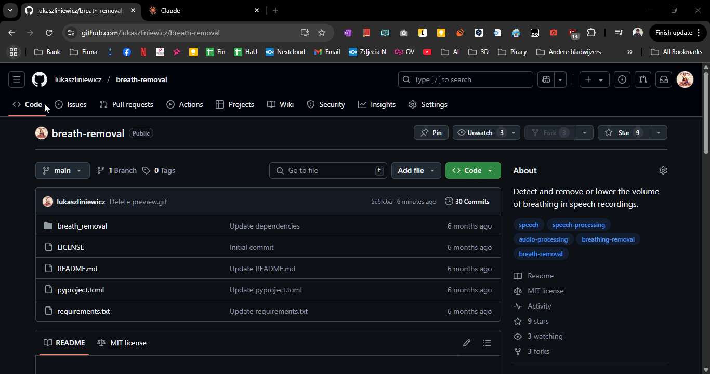

# ChaReCo - Chat Repo Context

A GUI and command-line tool to assist with providing chat LLMs with context about code repositories (local or remote) without manual copy-pasting. It outputs the directory structure and selected non-binary file contents, concatenated into a single text file. ChaReCo now includes powerful in-app search, advanced filtering with glob patterns, Jupyter Notebook conversion, and supports analyzing local folders directly.

Processing a lot of code through an API, especially for big proprietary models like Claude Sonnet or Opus (which are the most capable), can get very expensive very fast. The chat interface is much cheaper if one does it a lot. An integration with Github is not always possible and the models can't execute any code or browse the internet (at least Claude can't), which is when this may come in handy.

You can view a sample output from the [Pandrator](https://github.com/lukaszliniewicz/Pandrator) repository [here](https://github.com/lukaszliniewicz/LLM_Chat_Repo_Context/blob/main/example_pandrator.txt).

>[!Note]
>- This tool does not provide direct integration with LLMs.
>- It's meant to support manual copying and pasting into chat interfaces.
>- Token counts are estimates and may vary between different LLMs.



## Features

- Analyze Git repositories (public, or private using Personal Access Tokens - PAT) and local folders.
- Generate customizable folder structure views.
- Concatenate file contents with smart filtering:
    - Include/exclude specific file extensions (e.g., `.py,.js` or `*.tmp,*.log`).
    - Exclude folders using glob patterns (e.g., `**/__pycache__`, `node_modules/*`, `build/`).
    - Option to ignore `.git` related files, `LICENSE`, or `README` files.
- Convert Jupyter Notebooks (`.ipynb`) to Markdown for inclusion in the context.
- In-app content search with options for:
    - Regular Expressions (Regex)
    - Case sensitivity
    - Whole word matching
- Dynamically select/deselect individual files or entire folders in the tree view to customize the final output.
- Estimate token counts for the generated output.
- Improved performance with background processing for analysis and search.
- Copy output to clipboard or save to a text file.

## How to Use

There are a few ways to get ChaReCo running:

**1. Download the .exe (Windows)**
   - Head to the [Releases page](https://github.com/lukaszliniewicz/ChaReCo/releases) on GitHub.
   - Download the latest `.exe` file.
   - Run the executable. No installation is required.

**2. Install from GitHub using pip (Recommended for Python users)**
   - Ensure Git and Python (3.8+) are installed and accessible in your PATH.
   - Open your terminal or command prompt and run:
     ```bash
     pip install git+https://github.com/lukaszliniewicz/ChaReCo.git
     ```
   - Once installed, you should be able to run the GUI using the command:
     ```bash
     chareco
     ```

**3. Manual Setup from Cloned Repository**
   - Ensure Git and Python (3.8+) are installed.
   - Clone the repository:
     ```bash
     git clone https://github.com/lukaszliniewicz/ChaReCo.git
     ```
   - Navigate into the directory:
     ```bash
     cd ChaReCo
     ```
   - Install dependencies:
     ```bash
     pip install -r requirements.txt
     ```
   - Run the application:
     ```bash
     python run.py
     ```
     
**Using the Application:**

1.  Launch ChaReCo.
2.  Enter a Git repository URL (for private GitHub repos, you can provide a PAT) or select a local folder path.
3.  Configure analysis options:
    *   Toggle directory structure, file concatenation.
    *   Set filters for included/excluded file extensions.
    *   Define glob patterns for excluding specific folders (e.g., `**/__pycache__`, `node_modules/*`).
    *   Choose whether to include/exclude `.git` related files, `LICENSE`, or `README` files.
4.  Click "Analyze Repository" or "Analyze Local Folder".
5.  Once analysis is complete:
    *   View the generated structure and concatenated content.
    *   Use the **Search bar** to find specific text within the loaded files (supports regex, case sensitivity, whole word). Search results will highlight matching files in the tree.
    *   Select/deselect individual files or entire folders in the tree view to dynamically update the content in the main text area.
    *   Copy the selected content to the clipboard or save it to a file.
6.  Use the generated text output in your LLM chat conversations.

## Use Cases and Examples

Many of the original use cases remain highly relevant, now enhanced by more precise filtering and in-app search.

### 1. Code Review and Refactoring
Example: You're working on a large JavaScript project and want to refactor the authentication system.
- Use ChaReCo to analyze the repository.
- Use include/exclude patterns (e.g., include `*.js,*.ts`, exclude folders `node_modules/*,dist/*`) to focus on source code.
- Generate the folder structure to give the LLM an overview.
- Select files related to authentication (e.g., `auth.js`, `login.js`, `userModel.js`) in the tree view.
- Ask the LLM: "Based on this structure and these files, how can I refactor the authentication system to be more secure and efficient?"

### 2. Implementing New Features
Example: You need to add a new API endpoint to your Flask application.
- Provide the full concatenated output of your Flask app to the LLM, filtering out test directories or virtual environments using glob patterns (e.g., `**/tests/*`, `venv/*`).
- Ask: "Given this existing Flask application, how would you implement a new endpoint for user profile updates?"

### 3. Debugging
Example: Your React application has a state management bug, and you suspect it's related to a specific prop.
- Use ChaReCo to load your React components.
- Utilize the **search feature** to find all occurrences of the problematic prop or state variable. This helps identify relevant files quickly.
- Select these files and provide their content to the LLM.
- Ask: "I'm experiencing issues with state updates related to `[propName]` in these components. Can you identify potential causes and suggest fixes?"

### 4. Code Style and Best Practices
Example: Ensuring consistent coding style across a Python project.
- Select a variety of Python files from different parts of your project. Use glob patterns to exclude auto-generated files or virtual environments.
- Ask the LLM: "Review these files and suggest changes to make the coding style more consistent with PEP 8. Also, point out any Python best practices we're not following."

### 5. Documentation Generation
Example: Creating documentation for a complex module containing Python files and Jupyter Notebooks.
- Use ChaReCo to copy the contents of a specific module. It will automatically convert `.ipynb` files to Markdown.
- Ask the LLM: "Based on this code (including the converted notebooks), can you generate comprehensive documentation including function descriptions, parameters, return values, and usage examples?"

### 6. Learning and Understanding Code
Example: You've joined a new project and need to understand the codebase quickly.
- Generate the folder structure of the entire project.
- Use the **search feature** to find key terms, entry points (e.g., `main`, `app.run`), or specific API calls to understand data flow.
- Ask the LLM: "I want to understand how this project works. Based on this structure and the content of `main.py` and `core_module/`, can you explain the main workflow?"

### 7. Migrating Between Technologies
Example: Moving from jQuery to vanilla JavaScript.
- Copy your jQuery-heavy JavaScript files.
- Ask the LLM: "How would you rewrite these jQuery functions using modern vanilla JavaScript? Please provide examples for each conversion."

### 8. Security Auditing
Example: Checking for common security vulnerabilities in a Node.js application.
- Provide the `package.json`, main server files, and any authentication/authorization modules to the LLM.
- Use the **search feature** to look for known vulnerable functions or patterns (e.g., `eval(`, `dangerouslySetInnerHTML`).
- Ask: "Can you review these files for potential security vulnerabilities? Focus on areas like input validation, authentication, dependency issues, and usage of potentially unsafe functions I've highlighted."

### 9. Performance Optimization
Example: Optimizing database queries in a Django application.
- Copy your Django `models.py` and `views.py` related to database operations.
- Ask the LLM: "Analyze these Django models and views. Can you suggest ways to optimize the database queries for better performance, perhaps by identifying N+1 query problems or suggesting better indexing?"

### 10. API Design
Example: Designing a RESTful API for an existing application.
- Share the current codebase structure and any existing API-related files.
- Ask: "Based on this application structure, how would you design a comprehensive RESTful API? Include suggestions for endpoints, HTTP methods, and data formats."

### 11. Navigating and Querying Codebases
Example: You need to find all instances of a deprecated function or understand where a specific configuration variable is used across a large project.
- Load the entire repository or relevant sub-directory into ChaReCo.
- Use the **search feature** with the function name or variable. Employ regex for more complex queries (e.g., `config\.get\(['"]API_KEY['"]\)`).
- The tool will highlight all matching files, allowing you to quickly gather the context of these occurrences for the LLM or your own understanding.

## License

[MIT License](LICENSE)
