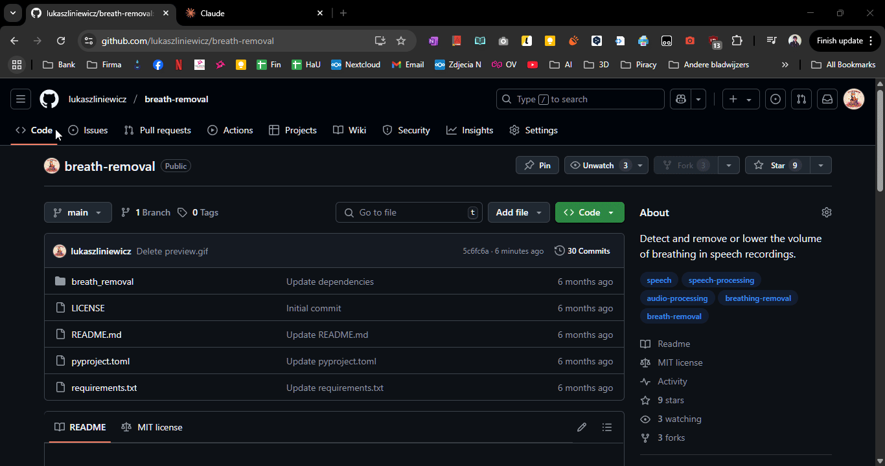

# ChaReCo - Chat Repo Context

A GUI and command-line tool for creating bounded, searchable context from local folders and Git repositories. It produces a deterministic folder tree and selected text-file content for pasting into an LLM chat.

You can view a sample output from the [Pandrator](https://github.com/lukaszliniewicz/Pandrator) repository [here](https://github.com/lukaszliniewicz/LLM_Chat_Repo_Context/blob/main/example_pandrator.txt).

>[!Note]
>- This tool does not provide direct integration with LLMs.
>- It's meant to support manual copying and pasting into chat interfaces.
>- It is not an IDE replacement.
>- Token counts use `cl100k_base` and remain estimates.
>- Review generated context before sharing it with a third party.



## Features

- Analyze public repositories, private GitHub repositories with a PAT, and local folders.
- Shallow-clone remote repositories and record a manifest with source, revision, and limits.
- Filter with comma- or space-separated extensions and glob patterns. Notebook files follow the same filters as other files.
- Prune ignored trees before scanning; skip symlinks, binaries, oversized files, and likely secret files by default.
- Convert included Jupyter notebooks to Markdown.
- Bound individual file size and total output size to protect the UI and clipboard.
- Search loaded content asynchronously with regex, case-sensitive, and whole-word modes. Results are highlighted in the file tree.
- Select files or folders recursively; copied selections retain relative paths and accurate line numbers.
- Refresh a local folder without losing selected files.
- Save the full analysis as a UTF-8 text file directly from the GUI.
- Use the GUI (`chareco` or `python -m chareco`) or the headless CLI (`chareco-context`).

## How to Use

ChaReCo requires Python 3.10 or newer.

**1. Install from PyPI (Recommended for Python users)**
   - Ensure Python 3.10+ is installed and accessible in your PATH.
   - Open a terminal and run:
     ```bash
     python -m pip install --upgrade chareco
     ```
   - Run the GUI:
     ```bash
     chareco
     ```
   - Or produce context from a terminal:
     ```bash
     chareco-context --local /path/to/project --include .py,.md --output context.txt
     ```

**2. Download the .exe (Windows)**
   - Head to the [Releases page](https://github.com/lukaszliniewicz/ChaReCo/releases) on GitHub.
   - Download the latest `.exe` file.
   - Run the executable. No installation is required.

**3. Manual Setup from a Cloned Repository**
   - Ensure Git and Python 3.10+ are installed.
   - Clone the repository:
     ```bash
     git clone https://github.com/lukaszliniewicz/ChaReCo.git
     ```
   - Navigate into the directory:
     ```bash
     cd ChaReCo
     ```
   - Install dependencies:
     ```bash
      python -m pip install -e .
     ```
   - Run the application:
     ```bash
     python run.py
     ```
     
**Using the GUI:**

1.  Launch ChaReCo.
2.  Enter a Git repository URL (optionally a branch/tag; a PAT is sent only to exact `https://github.com` URLs and is never stored) or select a local folder path.
3.  Configure analysis options:
    *   Toggle directory structure, file concatenation.
    *   Set filters for included/excluded file extensions.
    *   Define comma- or space-separated glob patterns for excluded folders/files.
    *   Set file/output limits. The defaults are 1 MiB per file and 20 MiB total.
4.  Click **Analyze**.
5.  Once analysis is complete:
    *   View the generated structure and concatenated content.
    *   Use the **Search bar** to find specific text within the loaded files (supports regex, case sensitivity, whole word). Search results will highlight matching files in the tree.
    *   Select/deselect individual files or folders; copying preserves each file's relative path.
    *   For local folders, use the **Refresh** button to reload the folder's contents. Your file selections will be preserved, allowing you to quickly copy the latest versions of your chosen files.
    *   **All** copies the complete analysis; **Visible** copies the current view.
6.  Review the generated text, then use it in your LLM chat conversation.

**Using the CLI:**

```bash
# Local folder
chareco-context --local ./my-project --include .py,.md --exclude-pattern "**/__pycache__" --output context.txt

# Private GitHub repository; the token stays in the environment, not shell history
export GITHUB_TOKEN=github_pat_...
chareco-context https://github.com/org/private-repo.git --branch main --pat-env GITHUB_TOKEN > context.txt
```

Run `chareco-context --help` for all options.

## Building release artifacts

On Windows, install the build extra and create a single-file executable:

```bash
python -m pip install .[build]
python -m PyInstaller --noconfirm --clean --onefile --windowed --name ChaReCo --hidden-import jupytext run.py
```

The executable is written to `dist/ChaReCo.exe`.

On Fedora or another x86_64 Linux host, use the reproducible AppImage builder:

```bash
python3 -m venv .venv
.venv/bin/python -m pip install --upgrade pip
.venv/bin/python -m pip install '.[build]'
./scripts/build_appimage.sh .venv/bin/python
```

The AppImage is written to `dist/ChaReCo-<version>-x86_64.AppImage`.

## Use Cases and Examples

Many of the original use cases remain highly relevant, now enhanced by more precise filtering and in-app search.

### 1. Code Review and Refactoring
Example: You're working on a large JavaScript project and want to refactor the authentication system.
- Use ChaReCo to analyze the repository.
- Use include/exclude patterns (e.g., include `*.js,*.ts`, exclude folders `node_modules/*,dist/*`) to focus on source code.
- Generate the folder structure to give the LLM an overview.
- Select files related to authentication (e.g., `auth.js`, `login.js`, `userModel.js`) in the tree view.
- Ask the LLM: "Based on this structure and these files, how can I refactor the authentication system to be more secure and efficient?"

### 2. Implementing New Features
Example: You need to add a new API endpoint to your Flask application.
- Provide the full concatenated output of your Flask app to the LLM, filtering out test directories or virtual environments using glob patterns (e.g., `**/tests/*`, `venv/*`).
- Ask: "Given this existing Flask application, how would you implement a new endpoint for user profile updates?"

### 3. Debugging
Example: Your React application has a state management bug, and you suspect it's related to a specific prop.
- Use ChaReCo to load your React components.
- Utilize the **search feature** to find all occurrences of the problematic prop or state variable. This helps identify relevant files quickly.
- Select these files and provide their content to the LLM.
- Ask: "I'm experiencing issues with state updates related to `[propName]` in these components. Can you identify potential causes and suggest fixes?"

### 4. Code Style and Best Practices
Example: Ensuring consistent coding style across a Python project.
- Select a variety of Python files from different parts of your project. Use glob patterns to exclude auto-generated files or virtual environments.
- Ask the LLM: "Review these files and suggest changes to make the coding style more consistent with PEP 8. Also, point out any Python best practices we're not following."

### 5. Documentation Generation
Example: Creating documentation for a complex module containing Python files and Jupyter Notebooks.
- Use ChaReCo to copy the contents of a specific module. It will automatically convert `.ipynb` files to Markdown.
- Ask the LLM: "Based on this code (including the converted notebooks), can you generate comprehensive documentation including function descriptions, parameters, return values, and usage examples?"

### 6. Learning and Understanding Code
Example: You've joined a new project and need to understand the codebase quickly.
- Generate the folder structure of the entire project.
- Use the **search feature** to find key terms, entry points (e.g., `main`, `app.run`), or specific API calls to understand data flow.
- Ask the LLM: "I want to understand how this project works. Based on this structure and the content of `main.py` and `core_module/`, can you explain the main workflow?"

### 7. Migrating Between Technologies
Example: Moving from jQuery to vanilla JavaScript.
- Copy your jQuery-heavy JavaScript files.
- Ask the LLM: "How would you rewrite these jQuery functions using modern vanilla JavaScript? Please provide examples for each conversion."

### 8. Security Auditing
Example: Checking for common security vulnerabilities in a Node.js application.
- Provide the `package.json`, main server files, and any authentication/authorization modules to the LLM.
- Use the **search feature** to look for known vulnerable functions or patterns (e.g., `eval(`, `dangerouslySetInnerHTML`).
- Ask: "Can you review these files for potential security vulnerabilities? Focus on areas like input validation, authentication, dependency issues, and usage of potentially unsafe functions I've highlighted."

### 9. Performance Optimization
Example: Optimizing database queries in a Django application.
- Copy your Django `models.py` and `views.py` related to database operations.
- Ask the LLM: "Analyze these Django models and views. Can you suggest ways to optimize the database queries for better performance, perhaps by identifying N+1 query problems or suggesting better indexing?"

### 10. API Design
Example: Designing a RESTful API for an existing application.
- Share the current codebase structure and any existing API-related files.
- Ask: "Based on this application structure, how would you design a comprehensive RESTful API? Include suggestions for endpoints, HTTP methods, and data formats."

### 11. Navigating and Querying Codebases
Example: You need to find all instances of a deprecated function or understand where a specific configuration variable is used across a large project.
- Load the entire repository or relevant sub-directory into ChaReCo.
- Use the **search feature** with the function name or variable. Employ regex for more complex queries (e.g., `config\.get\(['"]API_KEY['"]\)`).
- The tool will highlight all matching files, allowing you to quickly gather the context of these occurrences for the LLM or your own understanding.

### 12. Streamlining Multi-Model Development Workflows
Example: You are using a CLI-based coding assistant like Aider with a faster, cheaper model for initial development. However, you occasionally need guidance from a more powerful model (like Claude Opus or GPT-4) via its chat interface.
- Analyze your local project folder in ChaReCo and select the key files you are working on.
- Use your CLI tool to make changes to the code.
- Instead of manually finding and re-selecting the modified files in ChaReCo, simply click the **Refresh** button. ChaReCo will reload the folder content while keeping your file selections intact.
- Click "Copy Files" to get the latest version of your selected files.
- Paste this updated context into the chat interface of the powerful model and ask for high-level feedback, refactoring ideas, or architectural guidance that you can then implement with your CLI assistant. This workflow saves time and avoids the tedious process of re-selecting files.

## License

[MIT License](LICENSE)
